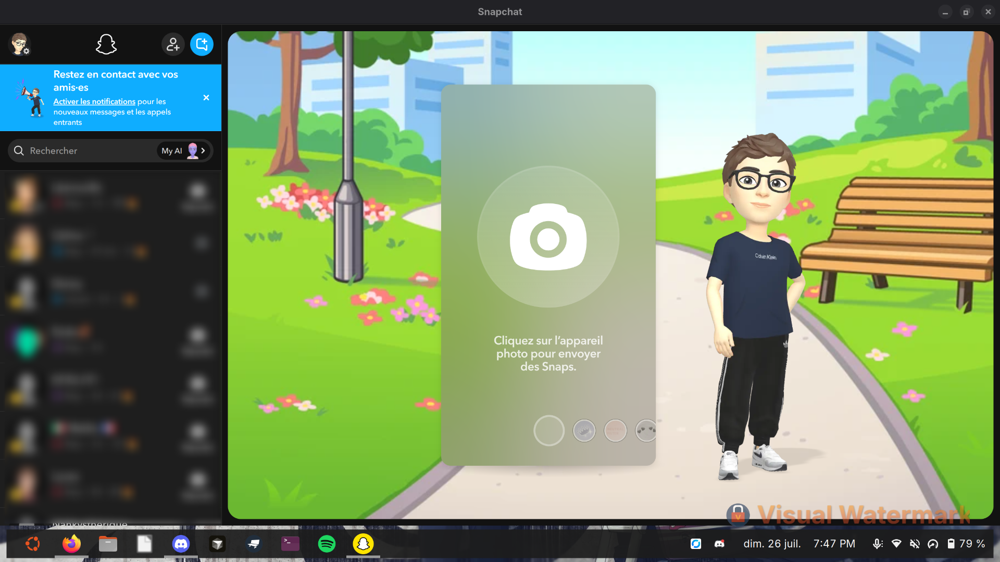

# Snapchat Desktop

Client Linux autonome pour [Snapchat Web](https://web.snapchat.com).

Tu gardes ton navigateur habituel (Firefox, etc.). Cette app ouvre Snapchat dans sa propre fenetre, avec son icone dans le menu et dans le dock.

Le paquet `.deb` embarque tout ce qu'il faut. Tu n'as pas besoin d'installer Chrome ou Chromium sur le systeme.

<p align="center">
  
</p>

## Fonctionnalites

- Fenetre dediee a Snapchat Web (pas d'onglets navigateur)
- Icone Snapchat dans les applications et le dock
- Paquet `.deb` autonome pour Ubuntu / Debian
- Session conservee entre les lancements
- Aucune dependance a un navigateur Chrome/Chromium deja installe

## Installation

### Depuis la release GitHub (recommande)

1. Telecharge le `.deb` sur la page [Releases](https://github.com/KendiiiX/snapchat-desktop/releases)
2. Installe-le :

```bash
sudo apt install ./snapchat-desktop_1.2.0_amd64.deb
```

3. Ouvre **Snapchat** depuis le menu des applications

Pour mettre a jour plus tard, retelecharge le nouveau `.deb` et relance la meme commande.

### Depuis les sources

```bash
git clone https://github.com/KendiiiX/snapchat-desktop.git
cd snapchat-desktop
npm install
npm run dist:deb
sudo apt install ./dist/snapchat-desktop_1.2.0_amd64.deb
```

## Utilisation

Apres installation, lance Snapchat comme n'importe quelle autre app :

- menu des applications → **Snapchat**
- ou en terminal :

```bash
snapchat-desktop
```

Connecte-toi une premiere fois. Ta session reste en place aux prochains demarrages.

## Developpement

Pre-requis : Node.js 18+ et npm.

```bash
git clone https://github.com/KendiiiX/snapchat-desktop.git
cd snapchat-desktop
npm install
npm start
```

### Scripts npm

| Commande | Description |
| --- | --- |
| `npm start` | Lance l'app en local |
| `npm run dist:deb` | Genere le paquet `.deb` dans `dist/` |
| `npm run pack` | Genere le dossier non packagé (debug) |

### Structure

```
snapchat-desktop/
├── main.js          # Processus principal Electron
├── preload.js       # Preload isole
├── assets/          # Icones et capture d'ecran
├── build/           # Ressources pour electron-builder
├── package.json
└── README.md
```

## Desinstallation

```bash
sudo apt remove snapchat-desktop
```

## Notes

- Snapchat Web reste un service de Snap Inc. Cette app n'est pas officielle.
- Sur certains PC Linux, le rendu passe par un mode logiciel pour eviter un ecran noir GPU.
- Teste surtout sur Ubuntu recent (GNOME).

## Licence

MIT. Voir [LICENSE](LICENSE).
